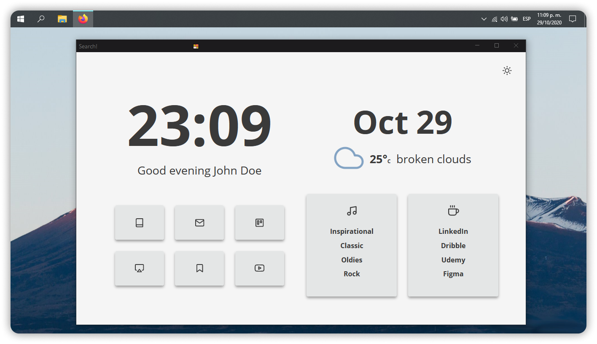

<h1>SimplerentFox</h1>
<b>🦊 Windows Version</b>

### Installation

1. In the searchbar type `about:config`. A dialog will be shown to you. Press the **I accept the risk**button.
2. Search for **`toolkit.legacyUserProfileCustomizations.stylesheets`**, **`layers.acceleration.force-enabled`**, **`gfx.webrender.all`**, and **`svg.context-properties.content.enabled`**. Change them to **True**
3. Go to your Firefox profile: `C:\Users\<USERNAME>\AppData\Roaming\Mozilla\Firefox\Profiles\XXXXXXX.default-XXXXXX`
4. Create a folder and name it **`chrome`** (with lowercase).
5. You can choose between the three versions: **HideURLBar**, **WithURLBar** and **OneLine** (You can see them here: [Versions](#three-versions)). Once you choose your version  and rename the file you choose into `userChrome.css` 
6. Then paste the `userChrome.css` and the `userContent.css` files into the folder
7. (Optional) If you don't know if use a theme or not, you can use the Add-on theme I made for a better experience: [Add-on Theme](https://addons.mozilla.org/en-US/firefox/addon/simplerentfox/)
 
> E N J O Y 🦊

> ### Transparency Note
>
> Transparency in Windows breakes the window behavior. You can change the colors in the variable section of the code and still add transparency, but the window manager will have some bugs with maximized firefox.